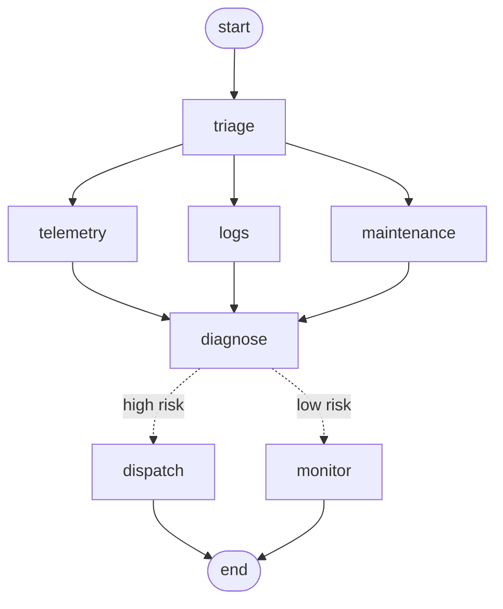

# agent-graph

A small, dependency-free runtime for **stateful agent workflows**: nodes, conditional edges, parallel fan-out, **checkpoints with crash recovery**, **human-in-the-loop interrupts**, retries and tracing. It is the core of what frameworks like LangGraph provide, in about 600 lines you can read in one sitting and test exhaustively.



## Execution model

Runs proceed in **supersteps** (bulk-synchronous, Pregel-style):

1. Every node scheduled for a step reads the **same state snapshot** and returns a partial update.
2. Nodes in one step run **concurrently**; their updates are merged through per-key **reducers** (`append`, `add`, `merge_dict`, or overwrite) in a **fixed order**, so results never depend on thread timing.
3. The successors of every node that ran form the next step. A node reached by several branches runs once, which gives fan-out and fan-in.
4. State and frontier are **checkpointed after every step** (in memory or SQLite). That makes three things possible: pausing for a human, resuming after a crash without redoing finished work, and inspecting the full history of a run.

```python
from agentgraph import END, START, StateGraph, SQLiteCheckpointer, append

g = StateGraph({"evidence": append})
g.add_node("telemetry", fetch_telemetry).add_node("logs", fetch_logs).add_node("diagnose", diagnose)
g.add_node("dispatch", dispatch).add_node("monitor", monitor)
g.add_edge(START, ["telemetry", "logs"])                       # two sources, in parallel
g.add_edge("telemetry", "diagnose").add_edge("logs", "diagnose")
g.add_conditional_edges("diagnose", lambda s: s["risk"], {"high": "dispatch", "low": "monitor"})
g.add_edge("dispatch", END).add_edge("monitor", END)

app = g.compile(checkpointer=SQLiteCheckpointer("runs.db"), interrupt_before=["dispatch"])
r = app.invoke({"robot": "arm-07"}, thread_id="inc-42")       # pauses before dispatch
r = app.resume("inc-42", update={"approver": "shift-lead"})    # human approves, run continues
```

## Features

| | |
|---|---|
| Parallel fan-out / fan-in | static (`add_edge(a, [b, c])`) or dynamic (a router returns a list) |
| Conditional routing and loops | `add_conditional_edges`, with a recursion limit against runaway loops |
| Human-in-the-loop | `interrupt_before` / `interrupt_after`; the human's update is persisted **before** the next step runs, so a crash cannot lose an approval |
| Durability | `MemoryCheckpointer`, `SQLiteCheckpointer` (resume from a new process) |
| Reliability | per-node `RetryPolicy` with exponential backoff and exception filters |
| Observability | structured events (start/end/error, attempt, duration) → JSONL, per-node summary, Mermaid export |
| Agents | `tool_agent_graph`: a model ⇄ tools loop; tool errors go back to the model instead of crashing; tool-round cap |
| Models | `ScriptedModel` (deterministic, offline) and `AnthropicModel` (Claude, tool use) behind one interface |

## Examples

```bash
pip install -e ".[dev]"
python examples/incident_triage.py   # parallel gathering, approval gate, crash + resume from SQLite
python examples/tool_agent.py        # tool-using agent (offline; --model <id> to use Claude)
pytest
```

`incident_triage.py` output:

```
[interrupted] after 3 steps in 0.41s (3 sources x 0.4s ran in parallel)
  diagnosis: probable joint-3 gearbox wear causing overcurrent | risk: high | waiting on: ['dispatch']

human approves; ticketing API is down on the first try:
  crashed: ticketing API unavailable
  resumed -> [done] in 0.00s: WO-1003 | stop robot + work order | approved by shift-lead

checkpoints: [(0, 'running'), (1, 'running'), (2, 'running'), (3, 'running'), (3, 'interrupted_before'), (3, 'resumed'), (4, 'done')]
```

The three 0.4 s data sources finish in 0.41 s because they run in parallel. After the crash, a fresh process resumes from the SQLite file and only re-runs `dispatch`, keeping the approval.

## Tests

The tests cover the guarantees that matter in production:
- fan-out really is concurrent: a thread barrier would deadlock otherwise
- merges are deterministic regardless of finish order
- a join node runs once
- an approval survives a crash after resume
- a crashed run resumes from disk without re-running expensive steps
- retries and the recursion limit work
- the tool agent recovers from tool errors and respects its round cap

## Design notes and limits

- State must be JSON-serialisable (checkpoints are JSON).
- Branches of different lengths reach a join in different supersteps, so the join runs once per arrival. Keep parallel branches the same length, or add a step that collects the results.
- Nodes run in threads, which suits I/O-bound work (LLM and API calls). CPU-heavy nodes should hand off to a process pool.

## License

MIT
