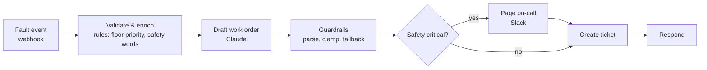

# n8n-ai-workflows

Importable **n8n workflows with LLM steps**, built the way production automations should be built:

- Every model output is **validated before anything acts on it**.
- Every workflow has a **fallback** when the model misbehaves.
- The JavaScript is **unit-tested**.
- Each workflow is **run end to end inside a real n8n instance** in CI.

| Workflow | Trigger | What it does | Guardrail worth stealing |
|---|---|---|---|
| [Research digest](workflows/research-digest.json) | weekdays 07:00 | arXiv → Claude ranks papers for relevance → Slack | Remembers what it sent (no repeats); keyword ranking if the model reply is unusable |
| [Robot fault triage](workflows/robot-fault-triage.json) | webhook | Fault event → Claude drafts a work order → ticket; safety-critical faults page on-call | The model may **raise** priority but never lower it below the rule floor; the operator note is fenced as untrusted data |
| [Lead qualification](workflows/lead-qualification.json) | webhook | Form → spam filter → Claude scores fit → HubSpot + sales alert, or nurture | Spam is dropped *before* spending tokens; transparent rule-based score as fallback |
| [Fleet KPI report](workflows/fleet-kpi-report.json) | Mondays 08:00 | Availability, MTBF, MTTR, top faults → Claude summary → email | **Grounding check**: if the summary contains any number not in the data, it is replaced by a template |
| [Market move alert](workflows/market-move-alert.json) | every 15 min | EWMA-volatility z-score on price moves → Slack | Cooldown per symbol, bad ticks ignored, no alert until enough history |

## Robot fault triage



End-to-end run inside n8n with the external services stubbed. The fault note says "nearly hit a person" and the model proposes priority **low**:

```
Draft work order (Claude)   {"priority": "low", "title": "Gearbox check", ...}
Guardrails                  {"robot_id": "arm-07", "priority": "high", "safety_critical": true, ...}
Page on-call                ...
Create ticket               {"id": "WO-1001"}
```

## Using the workflows

1. In n8n: **Workflows → Import from file** and pick a JSON from [`workflows/`](workflows/).
2. Create the credentials named in the yellow sticky note. Claude calls use a **Header Auth** credential named `Anthropic API key` (header `x-api-key`), so no key is ever stored in the workflow.
3. Replace the example URLs (ticketing, fleet API, price feed) and Slack channels with yours.

Claude is called through the plain HTTP Request node against the Messages API. That keeps the workflows portable across n8n versions and makes the exact request visible. Models are set in one place (`src/_lib/llm.js`).

## How the repo is built

```
src/<workflow>/*.js     Code-node JavaScript as real files (linted, unit-tested)
src/_lib/llm.js         shared helpers: request builder, response text, robust JSON extraction
n8nkit/catalog.py       workflow definitions (nodes, wiring, sticky notes) in Python
n8nkit/builder.py       turns them into n8n JSON (deterministic ids, auto layout, retries on HTTP)
n8nkit/validate.py      static checks
n8nkit/e2e.py           runs every workflow inside a real n8n with external calls stubbed
workflows/*.json        generated, importable exports (CI fails if they drift from src/)
```

`python -m n8nkit check` validates every workflow:
- every node is reachable from a trigger
- every `$('Node')` reference points to a node that actually runs *earlier*
- no hard-coded secrets (Anthropic, OpenAI-style, Slack, GitHub, AWS, bearer tokens)
- every HTTP node has a retry policy, and every credential-auth node names its credential
- every LLM call feeds a Code node that validates its output
- a webhook waiting for a response can actually reach a Respond node

```bash
pip install -e ".[dev]"
python -m n8nkit build        # regenerate workflows/*.json after editing src/ or the catalog
python -m n8nkit check
pytest                        # unit tests run each Code node under Node.js with mocked n8n globals
npm install --no-save n8n@2 && N8N_BIN=node_modules/.bin/n8n pytest -k end_to_end   # real n8n
```

Verified by importing and executing all five workflows on **n8n 2.41**.

## License

MIT
